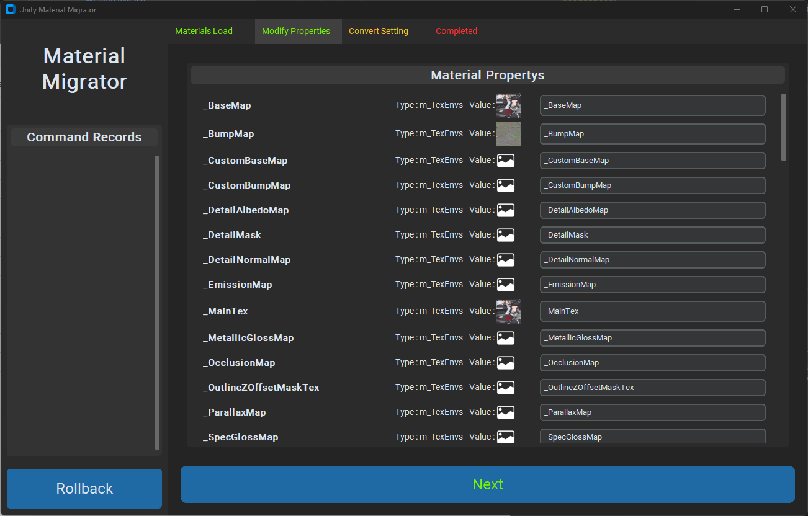

# UnityMaterialMigrator
  
**This is a tool that relinks incorrect Reference IDs of Materials in Unity.**  
*유니티에서 Mateiral들의 잘못된 Reference ID를 다시 링크 시켜주는 툴 입니다.*  
 

  

- [UnityMaterialMigrator](#unitymaterialmigrator)
  - [Guide](#guide)
    - [Step 1:](#step-1)
    - [Step 2:](#step-2)
    - [Step 3:](#step-3)
    - [Step 4:](#step-4)
    - [Step 5:](#step-5)

2023 University (한국공학대학교 3학년 1학기) Script Language - 1차 Project
* * *
## Guide  
### Step 1:
  
- Path Setting: Select the root folder containing the Materials to be changed.
You can select the Assets folder or select the parent folder containing the Assets folder.
If it's not a Unity Project, creating a parent folder as Assets folder manually will make the Tool recognize it.

- *경로 설정 : 바꿀 Material들이 포함되어있는 root 폴더를 선택해줍니다.*
*Assets 폴더를 선택하거나, Assets 폴더가 포함되어있는 상위 폴더를 선택해주면 됩니다.*  
*Unity Project가 아닐 경우 임의로 상위폴더를 Assets 폴더로 만들어주면 Tool이 인식할 수 있습니다.*  

 

### Step 2:
  
- The newly added Materials are categorized based on the Shader's GUID.
  When you select the desired Shader group, the button to proceed to the next step will be activated.
- *추가된 Material들은 Shader의 GUID에 따라 분류됩니다.*
  *원하는 Shader 그룹을 선택할 경우, 다음 단계로 넘어갈 수 있는 버튼이 활성화 됩니다.*

 

### Step 3:
  
- In the Modify Properties window, a list of Shader Reference IDs for the Materials is displayed.
  You can redefine the Reference ID value you want to modify here.
- *Modify Properties 창에서는 Material들의 Shader Reference ID 목록이 표시됩니다.* 
  *이곳에서 수정하고 싶은 Reference ID 값을 다시 정의하면 됩니다.*
 

### Step 4:
  
- In the Convert Setting window, you can configure conversion settings in more detail.
  You can select Materials that you do not want to convert, and enabling "Create Command" will record the operation history.
- *Convert Setting 창에서는 변환 설정을 보다 더 자세하게 할 수 있습니다.*
  *변환을 하지 않을 Mateiral들을 선택할 수 있고, Create Command 를 활성화 하면 작업 내역이 기록됩니다.*
 

### Step 5:
  

- When you press Convert, the conversion will take place, and you'll be returned to the initial screen.
  If you had previously enabled Create Command, the operation history will be recorded and displayed in the Command History.
  You can revert changes by pressing the Revert button.
- *최종적으로 Convert를 누르면 변환되며 처음화면으로 돌아갑니다.*
  *이전에 Create Command를 활성화 했다면 작업 내역이 기록되고 Command History에 표시됩니다.*
  *Revert 버튼을 누르면 변경을 되돌릴 수 있습니다.*